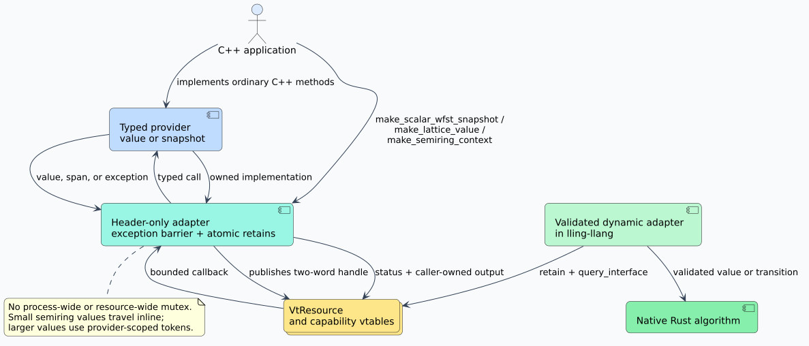

# C++20 host providers and resource ownership

The header-only C++ facade turns ordinary C++ values into the stable
`vinary-tree-interop` resource ABI. It gives C++ applications two symmetric
capabilities:

- `vinary_tree::interop::resource` owns exactly one resource retain and follows
  the Rule of Five; and
- `make_scalar_wfst_snapshot`, `make_lattice_value`, and
  `make_semiring_context` expose customer-defined C++ behavior to Rust and
  every other ABI consumer.

Include [`vinary_tree/interop.hpp`](../../include/vinary_tree/interop.hpp) and
compile as C++20 or newer. The facade is header-only and depends only on the C++
standard library and the canonical
[`vinary_tree_interop.h`](../../include/vinary_tree_interop.h) ABI declaration.
The complete executable examples live in
[`tests/cpp/providers.cpp`](../../tests/cpp/providers.cpp).



## Ownership in one page

A **retain** is one independently owned right to keep a resource alive. A
`VtResource` is only two copied words, so copying those words does not create a
retain. The C++ `resource` class makes this distinction explicit:

```cpp
#include <vinary_tree/interop.hpp>

namespace vt = vinary_tree::interop;

void consume_owned_resource(VtResource);

void accept_from_c(VtResource borrowed) {
  auto first = vt::resource::retain(borrowed);  // acquire one retain
  auto second = first;                         // acquire another retain
  VtResource transferred = second.release();   // transfer, do not release
  consume_owned_resource(transferred);
}  // first releases; second is empty
```

Use `resource::adopt` only when the caller already owns the supplied retain,
for example after a successful ABI callback writes a new resource. Use
`resource::retain` for a borrowed resource. Copying a `resource` calls
`retain`; moving it transfers ownership; destruction calls `release`. A
default-constructed resource is empty.

The corresponding lifecycle algorithm is:

```text
when borrowing a raw resource:
    validate the complete base vtable
    call retain exactly once
when copying an owning C++ resource:
    call retain exactly once
when moving or transferring ownership:
    move the two words without retaining
when an owning C++ resource leaves scope:
    call release exactly once
```

`resource_view` is a non-owning, callback-scoped view. Its `query` method
performs exact interface negotiation and returns `nullptr` only for
`VT_STATUS_UNSUPPORTED`; every other failure becomes `status_error`.

## Scalar weighted finite-state transducers

A weighted finite-state transducer (WFST) is a directed state graph whose arcs
carry input labels, output labels, and scalar weights. The C++ adapter exports
an immutable snapshot, not a mutable builder. A provider supplies four methods:

| Method | Return type | Meaning |
|---|---|---|
| `start()` | `std::uint64_t` | Snapshot-local start-state identifier. |
| `num_states()` | `std::optional<std::size_t>` | Exact count, or `std::nullopt` when lazy expansion makes it unknown. |
| `state_info(id)` | `wfst_state_info` | Validity, finality, and final weight for one state. |
| `state_arcs(id)` | `std::span<const VtWfstArc>` | Borrowed contiguous arcs valid through the callback. |

The span keeps paging allocation-free. The provider owns its backing storage;
the facade copies only the requested page into the caller-owned ABI buffer.

```cpp
struct RewriteAB {
  std::array<VtWfstArc, 1> arcs{{
      {'a', 'b', 1, 0.25, 1, 1, {0, 0, 0, 0, 0, 0}},
  }};

  std::uint64_t start() const { return 0; }
  std::optional<std::size_t> num_states() const { return 2; }

  vt::wfst_state_info state_info(std::uint64_t state) const {
    if (state == 0) return {true, false, 0.0};
    if (state == 1) return {true, true, 0.5};
    return {};
  }

  std::span<const VtWfstArc> state_arcs(std::uint64_t state) const {
    return state == 0 ? std::span<const VtWfstArc>(arcs)
                      : std::span<const VtWfstArc>();
  }
};

auto wfst = vt::make_scalar_wfst_snapshot(
    RewriteAB{},
    {VT_UNIT_DOMAIN_BYTE, VT_WEIGHT_DOMAIN_TROPICAL_F64,
     VT_WFST_FLAG_PARALLEL_REENTRANT | VT_WFST_FLAG_LAZY});
VtResource owned = wfst.release();
```

The facade always adds `VT_WFST_FLAG_IMMUTABLE`. It never adds
`VT_WFST_FLAG_PARALLEL_REENTRANT`: that is a semantic promise only the provider
can make. A lazy provider should cache or derive states in its own type using a
concurrency strategy consistent with its advertised flags.

## Lattice values

A lattice supplies a least upper bound (`join`) and greatest lower bound
(`meet`). The `lattice_provider` concept models one immutable value rather than
a global service. Its `join`, `meet`, and `equal` methods receive a
`lattice_operand`, which can read canonical bytes from any conforming provider
in the same domain. This permits a C++ value to interoperate with a Rust, Java,
or other host implementation without downcasting a foreign context pointer.

```cpp
std::uint64_t decode_u64(const std::vector<std::uint8_t>&);
std::vector<std::uint8_t> encode_u64(std::uint64_t);

struct MaxMinValue {
  std::uint64_t value;

  MaxMinValue join(vt::lattice_operand other) const {
    return {std::max(value, decode_u64(other.stable_bytes()))};
  }
  MaxMinValue meet(vt::lattice_operand other) const {
    return {std::min(value, decode_u64(other.stable_bytes()))};
  }
  bool equal(vt::lattice_operand other) const {
    return value == decode_u64(other.stable_bytes());
  }
  std::vector<std::uint8_t> stable_bytes() const {
    return encode_u64(value);
  }
  std::string diagnostic() const { return std::to_string(value); }
};

constexpr VtInterfaceId domain = {
    {'e','x','a','m','p','l','e','.','u','6','4','.','l','a','t','.','1'}};
auto value = vt::make_lattice_value(
    MaxMinValue{7}, {domain, VT_LATTICE_FLAG_PARALLEL_REENTRANT});
```

The domain identifier names both representation and laws. The adapter rejects
an operand whose negotiated lattice has a different identifier before calling
customer code. If the provider defines `stable_bytes()`, the adapter publishes
`VT_LATTICE_FLAG_STABLE_BYTES`; otherwise that capability remains absent. It
always implements bounded `join_many` and `meet_many`, including the specified
empty-fold retain, and therefore publishes `VT_LATTICE_FLAG_BATCH`.

`lattice_operand::stable_bytes` applies a 16 MiB defensive limit and permits at
most three attempts if a hostile or faulty foreign provider changes its
reported size. A final short write or impossible count is rejected.

## Generic semirings

A semiring defines two associative operations, addition (`plus`) and
multiplication (`times`), with identities `zero` and `one`. The adapter is
generic over `Provider::value_type`; it does not restrict customers to the
seven scalar `double` domains used by the WFST ABI.

The required provider methods are:

| Family | Required methods |
|---|---|
| Construction | `zero`, `one` |
| Algebra | `plus`, `times` |
| Comparison | `equal`, `approx_equal`, `natural_order` |
| Representation | `stable_bytes`, `diagnostic` |

`natural_order` returns `semiring_order`. Canonical bytes must agree with exact
equality whenever the `VT_SEMIRING_PROPERTY_HASHABLE` law is declared.

```cpp
struct Tropical {
  using value_type = double;

  double zero() const { return std::numeric_limits<double>::infinity(); }
  double one() const { return 0.0; }
  double plus(double a, double b) const { return std::min(a, b); }
  double times(double a, double b) const { return a + b; }
  bool equal(double a, double b) const { return a == b; }
  bool approx_equal(double a, double b, double epsilon) const {
    return std::abs(a - b) <= epsilon || a == b;
  }
  vt::semiring_order natural_order(double a, double b) const;
  std::vector<std::uint8_t> stable_bytes(double value) const;
  std::string diagnostic(double value) const;
};

auto tropical = vt::make_semiring_context(
    Tropical{},
    {domain,
     VT_SEMIRING_FLAG_PARALLEL_REENTRANT,
     VT_SEMIRING_PROPERTY_HASHABLE |
         VT_SEMIRING_PROPERTY_IDEMPOTENT_PLUS,
     std::nullopt});
```

The facade always publishes stable bytes and bounded batch folds. A trivially
copyable value no larger than eight bytes is encoded directly in the two-word
token, so scalar operations allocate no token nodes. Larger or non-trivial
values use independently owned provider-scoped nodes. Neither representation
uses a shared registry, mutex, or global cache. `clone_value` creates a logical
owned copy, and `release_values` validates a complete batch before consuming
any node.

### Optional semiring capabilities

Methods are detected at compile time. An optional vtable is discoverable only
when its complete method family exists:

| Capability | Methods and return |
|---|---|
| Division | `divide(a, b)` and `left_divide(a, b)` return `std::optional<value_type>`. |
| Kleene closure | `star(value)` returns `std::optional<value_type>`. |
| Numeric projection | `numerical_value`, `quantize`, and `to_probability`. |
| Declared properties | Always published from `semiring_options`; `closure_bound` is optional. |

An empty optional maps to `VT_STATUS_END`, representing an undefined quotient
or divergent closure. It is not converted to a sentinel weight.

## Failures and concurrency

No C++ exception crosses the C ABI. Every callback catches all exceptions:
`std::bad_alloc` becomes `VT_STATUS_LIMIT_EXCEEDED`, while another exception
becomes `VT_STATUS_PROVIDER_ERROR`. Output values are written only after their
construction succeeds. Null pointers, foreign semiring tokens, mismatched
lattice domains, duplicate heap-token releases, and malformed capability
tables are rejected with portable statuses.

The facade uses an atomic retain counter and no process-wide or resource-wide
lock. That does not make customer code thread-safe. Flags have these effects:

| Flag state | Contract |
|---|---|
| `THREAD_BOUND` | The consumer must keep calls on the importing thread. |
| `PARALLEL_REENTRANT` | Customer methods may be invoked concurrently and recursively. |
| Neither | The consuming dynamic adapter serializes or rejects overlapping calls according to its documented policy. |
| Both | Invalid; construction throws `std::invalid_argument`. |

## Build and verification

Installed CMake packages expose two header-only targets:

```cmake
find_package(vinary-tree-interop CONFIG REQUIRED)
target_link_libraries(my_c_consumer PRIVATE vinary-tree::interop)
target_link_libraries(my_cpp_provider PRIVATE vinary-tree::interop-cpp)
```

The C++ target requests `cxx_std_20`. The repository gate compiles the provider
suite with `-Wall -Wextra -Wpedantic -Werror` and runs it. To reproduce the
complete local gate without writing to a memory-backed temporary filesystem:

```sh
TMPDIR="$PWD/target/tmp" ./scripts/verify.sh
```

For the byte-level protocol, evolution rules, and trust boundary, continue with
the [ABI reference](../../docs/abi-reference.md),
[ABI evolution policy](../../docs/abi-evolution.md), and
[security model](../../docs/security-model.md).
