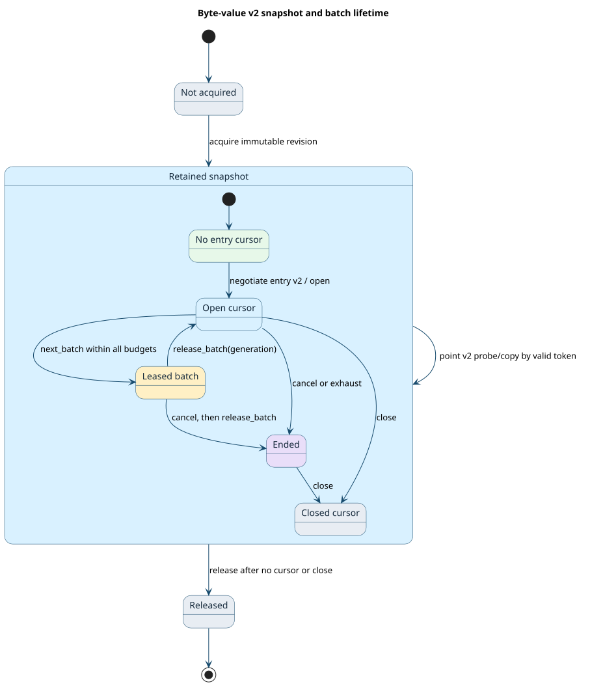

# Byte-value v2 finite contract

This document explains the executable safety model for the optional
`vt.dict.bytes.v2` point-value capability and `vt.dict.entry.v2` finite entry
stream. The normative wire layouts, error results, and ownership rules are in
the [ABI reference](abi-reference.md#optional-byte-values-and-entry-streaming-v2).
The model checks whether those rules remain consistent when a consumer
negotiates capabilities, copies a value, pages through entries, cancels, and
releases resources. It does not supply a native producer or binding.



## Terms and state

A **snapshot** is a retained immutable dictionary revision. A **graph token**
is a 64-bit cursor issued by one producer for a live snapshot; the token is
valid only in that snapshot's resource context. A **batch lease** is the
provider-owned descriptor and arena memory returned by one successful
`next_batch` call. Its generation identifies the exact lease to release.
**Absent** means no value; **present-empty** means a value exists with zero
bytes. These are different states even though both need zero payload bytes.

The [TLA+ module](../formal/ByteValueDictionaryV2.tla) represents one
producer's snapshot set and stores capability negotiation, token issuance,
copy metadata, cursor state, budgeted page counts, lease generation, and
cancellation in one state record. Every action either changes that record
atomically or is disabled. The point-value copy publishes bytes only on
`Ok`; a short buffer returns the required byte count and presence but
publishes zero bytes. Each page must satisfy all three caller limits:

```math
0 < n \leq E,\qquad U_{\mathrm{used}} \leq U,\qquad
B_{\mathrm{used}} \leq B.
```

Here $`n`$ is the number of complete entries, $`E`$ is the entry limit,
$`U`$ counts key units, and $`B`$ counts value bytes. A failed first-entry
fit leaves both the cursor index and lease unchanged. No action invokes a
foreign callback per key; the public entry vtable has only batch operations.

The seven finite configurations cover nonempty byte values and two-entry
paging, absent byte values, present-empty values with two simultaneously live
snapshots, point-only and entry-only v2 availability, bytes with no v2
capability despite v1 availability, and `UNIT` and `OPTIONAL_U64` v1
fallback. The model limits each byte payload to zero
or one byte, each page to at most two entries, and each snapshot to one
acquisition. These are **finite checking bounds**, not wire limits. Pointer
validity, C ABI layout, overflow, arbitrary byte strings, and hostile
metadata are checked by the C/Rust ABI tests and generated properties. A
numeric token collision between independent producers cannot be rejected
from a bare 64-bit word and is outside the token-authority guarantee.

## Invariant and executable-property ledger

[The ledger](../formal/byte_values_v2_ledger.json) is the exact source of
the invariant-to-test and invariant-to-mutation mapping. The generator
checks that every finite configuration lists all ten invariants, then emits
64 bounded ABI-model cases per property in
[the generated Rust tests](../tests/generated/byte_values_v2_properties.rs).
The mutation gate alters transitions or initial state, isolates the paired
invariant, and requires TLC to produce a counterexample. An unobserved
mutation fails the gate.

| TLA+ invariant | ABI-model property | Expected-failure mutation |
| --- | --- | --- |
| `TypeOK` | `property_type_ok` | out-of-range state value |
| `CapabilitySound` | `property_capability_sound` | advertise absent point capability |
| `NoByteValueErasure` | `property_no_byte_value_erasure` | route byte values through v1 |
| `SnapshotPinned` | `property_snapshot_pinned` | drop snapshot retain |
| `TokenAuthority` | `property_token_authority` | reuse a live token |
| `CopyAtomic` | `property_copy_atomic` | publish bytes on failed copy |
| `PageBounded` | `property_page_bounded` | understate page byte capacity |
| `LeaseGenerationSound` | `property_lease_generation_sound` | lose a live lease |
| `CancellationSticky` | `property_cancellation_sticky` | reopen after cancellation |
| `NoPerKeyDispatch` | `property_no_per_key_dispatch` | call once per key |

The generated tests exercise the Rust declarations of the C layouts and
the ABI consumer/provider model in `tests/byte_values_v2_contract.rs`. They
include tri-state values, old/new capability combinations, snapshot/token
pairing, retry copy metadata, page budgets, one-live-lease behavior, and
sticky cancellation. Separate tests in that file cover C/Rust offsets,
unknown raw statuses, malformed pointers and lengths, overflow, and
cross-provider same-word token aliasing. The header is compiled as both C
and C++ by `scripts/verify.sh`.

## Run and interpret the gate

```sh
python3 scripts/generate-byte-values-v2-properties.py --check
cargo test --test byte_values_v2_contract
python3 scripts/verify-byte-values-v2-formal.py --tlc-jar /path/to/tla2tools.jar
```

The formal command checks seven complete reachable state graphs, then ten
deliberate transition or initial-state mutations. Positive runs must end with no TLC error;
each mutation must violate its assigned invariant. The main model's state
space is finite because a snapshot is acquired at most once and all counters
are bounded. CI and the release validation workflow fetch the exact TLA+
tools 1.7.4 artifact by its SHA-256 digest before running this gate. The
`target/byte-values-formal/gate` logs retain each run's state count and
counterexample for diagnosis. These finite results establish the listed
safety obligations within the declared bounds; they do not prove arbitrary
provider memory safety or publication readiness for unimplemented v2 paths.
