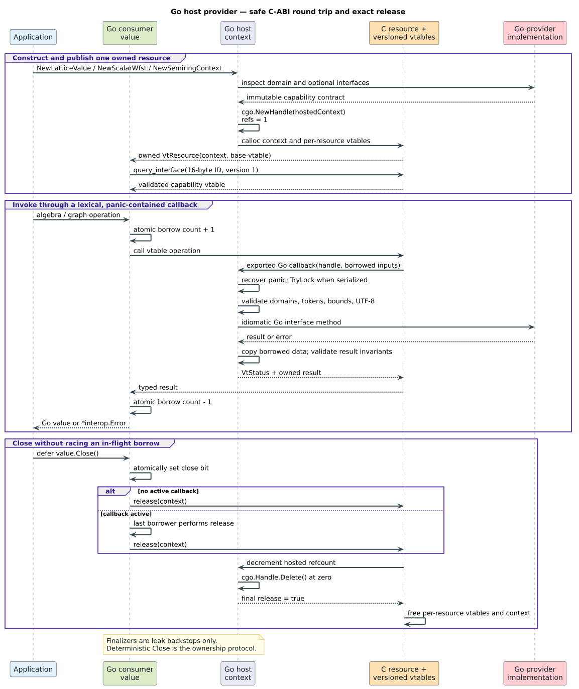

# Go resource providers and consumers

The Go module turns ordinary Go implementations into versioned Vinary Tree
resources that Rust, C, and other language bindings can retain and call. It
also consumes compatible lattice, scalar weighted finite-state transducer
(WFST), and dynamic-semiring resources without exposing Rust object layouts to
Go.

This guide is for application and binding authors who need native Vinary Tree
algorithms to use a custom Go algebra or graph. The
[ABI reference](../abi-reference.md) remains normative for byte layout and C
preconditions; this guide explains the safe, idiomatic Go surface.

## Concepts

A **resource** is a `VtResource`: an opaque context pointer plus a pointer to a
versioned base virtual-function table (vtable). A **provider** is a Go value
whose interface methods implement graph or algebra operations. A
**capability** is an optional vtable identified by an exact 16-byte interface
ID. A **lease** is an owned semiring token valid only in the operation context
that created it.

The bridge stores Go objects in `runtime/cgo.Handle` rather than passing Go
pointers through C. This is the standard Go mechanism for carrying a Go value
through C and back while respecting cgo's pointer rules; each handle remains a
resource until explicitly deleted. See the official
[`runtime/cgo.Handle` reference](https://pkg.go.dev/runtime/cgo#Handle).



## Install and verify

The module requires Go 1.25 or newer and cgo:

```sh
go get github.com/vinary-tree/vinary-tree-interop/bindings/go/v4
```

Run the maintained example from the repository root:

```sh
go -C bindings/go run ./examples/providers
```

Its expected output is:

```text
join={1,2,3} arcs=1 path-weight=5
```

The complete, compiled source is
[`bindings/go/examples/providers/main.go`](../../bindings/go/examples/providers/main.go).
The conformance suite in
[`provider_test.go`](../../bindings/go/provider_test.go) includes negative
paths, retained-lifetime tests, callback panic containment, paging validation,
and a concurrent serialized-provider test.

## Public surface

| Purpose | Provider or consumer types |
|---|---|
| Portable ownership | `NativeResource`, `Resource`, `Status`, `Error`, `InterfaceID` |
| Lattice provider | `LatticeProvider`, `StableLatticeProvider`, `BatchLatticeProvider`, `LatticeOptions` |
| Lattice consumer | `LatticeValue`, `LatticeOperand` |
| Scalar-WFST provider | `ScalarWfstProvider`, `PagedScalarWfstProvider`, `ScalarWfstOptions` |
| Scalar-WFST consumer | `ScalarWfst`, `WfstStateInfo`, `WfstArc`, `WfstArcPage` |
| Semiring provider | `SemiringProvider` and the optional stable, batch, division, star, numeric, and lawful interfaces |
| Semiring consumer | `SemiringContext`, `SemiringValue`, `NaturalOrder` |

Every owned consumer implements `Close`. Call it with `defer` immediately
after checking construction errors:

```go
graph, err := interop.NewScalarWfst(provider, options)
if err != nil {
	return err
}
defer graph.Close()
```

Finalizers are leak backstops, not deterministic ownership. `Close` is
idempotent and may race an active `WithResource` borrow: it atomically marks
the owner closed, and the last borrower performs the one native release.

## Lattice values

A lattice is a partially ordered domain in which every pair has a least upper
bound, **join**, and a greatest lower bound, **meet**. For values $`a`$ and
$`b`$, the provider computes $`a \mathbin{\vee} b`$ and
$`a \mathbin{\wedge} b`$.

Implement `LatticeProvider` on one immutable Go value:

```go
type LatticeProvider interface {
	DomainID() InterfaceID
	Join(*LatticeOperand) (LatticeProvider, error)
	Meet(*LatticeOperand) (LatticeProvider, error)
	Equal(*LatticeOperand) (bool, error)
	Diagnostic() (string, error)
}
```

`NewLatticeValue` publishes the value through `VtLatticeVTable` and returns a
consumer view of the same resource. Each successful join or meet must return a
new immutable provider with the same domain ID and optional capabilities.
Changing the domain, dropping stable-byte support, returning `nil`, or
panicking becomes `StatusProviderError`.

`LatticeOperand` is lexical. `LocalProvider` avoids an ABI round trip when the
operand was created by the same Go module instance; `StableBytes` copies a
foreign value's canonical representation when both implementations share the
domain contract. Every operand becomes closed when the callback returns, so a
provider must not retain it.

Implement `StableLatticeProvider` when foreign implementations need a
canonical encoding. Implement `BatchLatticeProvider` to handle bounded
`JoinMany` and `MeetMany` calls in one host transition. Otherwise, the bridge
uses a lawful iterative left fold without recursive stack growth.

## Scalar WFSTs

A scalar WFST has provider-scoped state IDs, optional input and output labels,
and `float64` weights. `ScalarWfstOptions` declares:

- `UnitDomain`: byte, Unicode scalar, or arbitrary unsigned 64-bit token;
- `WeightDomain`: tropical, log, probability, arctic, signed tropical, count,
  or Boolean;
- whether independent callbacks are parallel-reentrant;
- whether states are lazy and whether the graph is acyclic.

`ScalarWfstProvider` supplies the start state, an optional exact state count,
state finality, and outgoing arcs. `PagedScalarWfstProvider` is the preferred
extension for lazy or high-degree graphs because it avoids materializing a
complete outgoing list. The bridge validates every copied arc: byte and
Unicode labels must stay in domain, epsilon is represented by `HasInput` or
`HasOutput` rather than a sentinel, and weights must not be NaN.

`ScalarWfst.Snapshot` returns an independently owned view of the same immutable
revision. `StateArcsPage` copies one bounded page. `StateArcs` drains pages
iteratively and rejects a changing total or a provider that makes no progress.
The consumer never preallocates from an untrusted `Total` value.

The non-paged adapter deliberately does not memoize every state's arc list.
An unbounded cache would retain an arbitrarily large graph. Providers already
promise immutability; applications that need memoization should place a
workload-sized, explicitly bounded cache inside the provider and benchmark its
hit rate and eviction policy.

## Dynamic semirings

A semiring is a tuple $`(S, \oplus, \otimes, 0, 1)`$. Addition
$`\oplus`$ combines alternative paths; multiplication $`\otimes`$ extends a
path. Mohri's
[weighted-automata tutorial](https://research.google/pubs/weighted-automata-algorithms-tutorial/)
develops this connection to shortest-distance and transducer algorithms.

Implement `SemiringProvider` for identities, addition, multiplication, exact
and approximate equality, natural order, and diagnostics. Then construct a
context:

```go
context, err := interop.NewSemiringContext(minPlus{}, interop.SemiringOptions{})
if err != nil {
	return err
}
defer context.Close()

weight, err := context.NewValue(float64(2.5))
if err != nil {
	return err
}
defer weight.Close()
```

`NewValue` is available only for a Go-hosted context; a foreign runtime owns
its own value representation. `Zero`, `One`, `Plus`, `Times`, and the other
consumer methods work for either local or foreign contexts.

Optional Go interfaces map to independently discoverable ABI capabilities:

| Go interface | Capability |
|---|---|
| `StableSemiringProvider` | Canonical bytes on the base semiring vtable |
| `BatchSemiringProvider` | Bounded additive and multiplicative folds |
| `DivisibleSemiringProvider` | Division and weak left division |
| `StarSemiringProvider` | Partial Kleene closure |
| `NumericSemiringProvider` | Numerical value, quantization, and probability projection |
| `LawfulSemiringProvider` | Algebraic property bits and optional closure bound |

Division and star return a Boolean defined/converged result. `false` maps to
`StatusEnd`, which is a mathematical absence rather than a provider failure.
Approximation epsilon must be finite and nonnegative; quantization epsilon must
be finite and positive. Numerical projections may be infinite when the domain
permits it, but never NaN. A probability projection must be finite and
nonnegative.

Each `SemiringValue` owns one two-word token. Copying a Go pointer to the value
does not clone ownership; call `Clone` for an independent token. A value keeps
its operation context alive after the public `SemiringContext` view closes.
Cross-context, stale, forged, duplicate-release, and nil tokens are rejected
before state is mutated.

## Concurrency and reentrancy

`ParallelReentrant: true` promises that the Go provider tolerates independent
concurrent and reentrant calls. The bridge then imposes no provider-wide lock.
Without that promise, each resource has a small callback gate based on
`sync.Mutex.TryLock`: a concurrent or reentrant callback returns
`StatusProviderError` immediately instead of blocking a native worker and
risking a cross-runtime deadlock.

Resource ownership and in-flight borrows use atomics, not a global mutex. This
follows the synchronization rules in the
[Go memory model](https://go.dev/ref/mem). CI exercises the implementation with
the official [Go race detector](https://go.dev/doc/articles/race_detector):

```sh
go -C bindings/go test -race ./...
```

Thread safety of the bridge does not strengthen a provider's contract. Do not
set `ParallelReentrant` merely because the provider passed a sequential test.

## Error and trust boundary

The C ABI returns `VtStatus`; Go exposes failures as `*interop.Error` with an
operation and typed `Status`. Use `errors.As` rather than parsing messages.

Every exported Go callback contains panics and converts them to
`StatusProviderError`. It validates pointers before dereference, bounds batch
and byte sizes before allocation, checks capability and domain identities,
copies borrowed storage, validates UTF-8 diagnostics, and writes result
outputs only after successful provider execution. The complete adversarial
model is in the [binding security guide](../security-model.md).

## Performance guidance

- Pass `NativeResource` by its two machine words; never serialize a graph to
  hand it between Vinary Tree projects.
- Prefer batch methods when an algorithm can combine many values in one cgo
  transition. Current lattice and semiring batches are bounded at 256 values.
- Use `PagedScalarWfstProvider` for lazy or very high-degree states.
- Set `ParallelReentrant` only when the provider has no shared mutable hazard;
  it removes the serialized callback gate from the hot path.
- Keep provider values immutable. Stable encodings should be deterministic and
  should avoid an intermediate textual representation.
- Profile representative cross-boundary workloads. A lower cgo-call count is
  usually more consequential than a nanosecond-scale Go helper change.

## Maintainer verification

From the repository root, run:

```sh
raku scripts/generate-bindings.raku --check
go -C bindings/go vet ./...
go -C bindings/go test ./...
go -C bindings/go test -race -gcflags=all=-d=checkptr=2 ./...
```

The generator requires the private Go copy of
`vinary_tree_interop.h` to remain byte-identical to the canonical header.
Tests exercise the public provider and consumer surfaces through the actual C
vtables, not a Go-only mock. Any new capability must update the canonical
header, C bridge, Go API, executable example, negative tests, and family
extension-provider matrix together.
