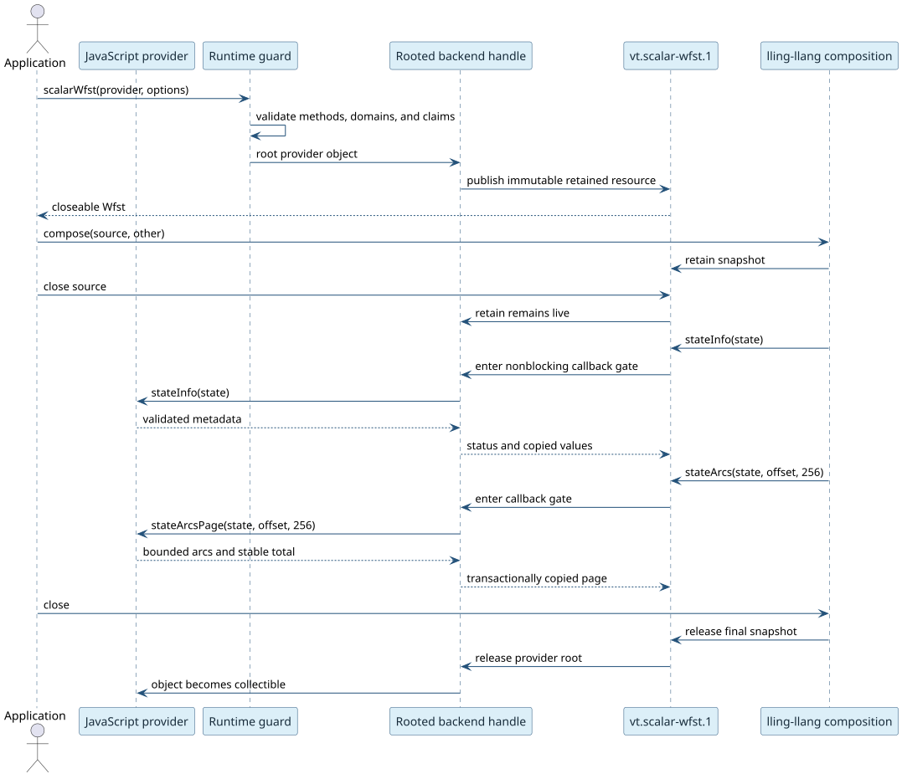

# JavaScript and TypeScript host providers

JavaScript, TypeScript, and ClojureScript applications can define an immutable
scalar weighted finite-state transducer (WFST) in host code and pass it to the
same lling-llang algorithms that consume Rust-owned WFSTs. The supported
runtime surfaces are Node-API, browser WebAssembly, and Node WASI Preview 1.

Use a host provider when transitions already live in JavaScript, when a graph
is computed lazily, or when an application-specific transducer should compose
with duallity without first rebuilding a `VectorWfst`.

## Complete example

This provider rewrites `cat` to `CAT` one scalar at a time:

```js
import { llingLlang } from "@vinary-tree/javascript-runtime";

const labels = [["c", "C"], ["a", "A"], ["t", "T"]];
const provider = {
  startState() {
    return 0n;
  },
  stateCount() {
    return 4n;
  },
  stateInfo(state) {
    return {
      valid: state >= 0n && state <= 3n,
      final: state === 3n,
      finalWeight: 0,
    };
  },
  stateArcs(state) {
    const index = Number(state);
    if (index < 0 || index >= labels.length) return [];
    const [input, output] = labels[index];
    return [{ input, output, target: state + 1n, weight: 0 }];
  },
};

using uppercase = llingLlang.scalarWfst(provider, {
  unitDomain: "unicode",
  weightDomain: "tropical-f64",
  lazy: true,
  acyclic: true,
});

console.log(uppercase.state(uppercase.start()));
```

The provider object is rooted until the last retained snapshot is released.
Closing `uppercase` does not invalidate a composition that already captured
it. `close()` and `Symbol.dispose` are deterministic and idempotent.

## Provider contract

`assertScalarWfstProvider(provider)` validates the required method shape.
`normalizeScalarWfstProviderOptions(options)` validates domains and capability
claims, fills defaults, and returns a frozen object. The runtime calls both
before it publishes a resource.

| Method | Result | Contract |
|---|---|---|
| `startState()` | `bigint` | Unsigned 64-bit provider-scoped start state. |
| `stateCount()` | `bigint \| null` | Exact count when cheaply known; `null` otherwise. |
| `stateInfo(state)` | `{ valid, final, finalWeight }` | Booleans plus a non-NaN scalar weight. An invalid state cannot be final. |
| `stateArcs(state)` | `readonly WfstProviderArc[]` | Complete outgoing arcs when the bounded page method is absent. |
| `stateArcsPage(state, start, capacity)` | `{ arcs, total }` | Optional bounded page. `start` and `total` are `bigint`; `capacity` is a small positive number. |

An arc has `input`, `output`, `target`, and `weight`. A `null` label is epsilon.
The target is an unsigned 64-bit `bigint`, and the weight is a non-NaN
JavaScript number. Label types follow the declared unit domain:

| Unit domain | Present label |
|---|---|
| `"byte"` | Integer from 0 through 255. |
| `"unicode"` | String containing exactly one Unicode scalar value. |
| `"u64"` | Unsigned 64-bit `bigint`. |

`stateArcsPage` is the preferred interface for high-degree states. A page may
contain at most `capacity` arcs; `total` must remain stable throughout one
state expansion; and a nonterminal page must make progress. Results are
validated and copied transactionally before the runtime publishes them.

## Options and capability claims

| Option | Default | Meaning |
|---|---|---|
| `unitDomain` | `"unicode"` | Representation of every present input and output label. |
| `weightDomain` | `"tropical-f64"` | One of the seven scalar semiring representations in `vt.scalar-wfst.1`. |
| `lazy` | `true` | States or arcs may be derived on demand. |
| `acyclic` | `false` | The reachable graph contains no directed cycle. |

The runtime always marks the captured facade immutable. It never advertises
parallel/reentrant callbacks for a JavaScript provider: one JavaScript object
belongs to one agent or event loop. A false `acyclic` value is conservative;
an incorrect true claim is a provider contract violation.

## Backend ownership model



| Backend | Root and dispatch representation | Raw-pointer rule |
|---|---|---|
| Node-API | Strong N-API reference, per-resource thread-safe cleanup function, and atomic retain count. | Native pointers remain inside the addon. |
| Browser WebAssembly | `JsValue` rooted in a WebAssembly-owned context with a nonblocking callback gate. | ABI pointers remain inside linear memory and never enter JavaScript. |
| WASI Preview 1 | Index-plus-generation JavaScript table; the guest owns one table retain and imports bounded callbacks. | JavaScript receives only integers, `bigint` state IDs, and linear-memory offsets. |

WASI generation checks prevent a stale handle from selecting a provider that
later reused the same slot. Guest code retains the WFST resource and drops the
global resource-table guard before invoking any host method. A callback may
therefore close its source without use-after-free or registry deadlock.

## Exceptions, reentrancy, and shutdown

Provider exceptions never unwind through C++, Rust, or WebAssembly. Each
backend translates them to `ProviderError`; provider-private exception text is
not treated as a portable error protocol. After failure, the callback gate is
cleared and later calls may succeed.

Calling the same provider recursively is rejected immediately. It does not
block, acquire a process-wide provider lock, or poison the resource. Node
cleanup may execute off the JavaScript thread, so it is scheduled through a
per-resource N-API cleanup function. Browser and WASI callbacks remain
synchronous on their owning JavaScript agent.

## Performance

Resource construction and snapshot retention take $`\Theta(1)`$ time and
storage. A full state expansion takes $`\Theta(a)`$ work for $`a`$ outgoing
arcs and uses at most 256 temporary arc records per boundary crossing.
Composition stays lazy: creating a product does not enumerate either graph.

Prefer `stateArcsPage` when a state can have hundreds of arcs. Keep state IDs
compact, avoid allocating intermediate object graphs in hot callbacks, and do
not memoize without a strict capacity and an eviction policy. Built-in Rust
WFSTs retain their monomorphized path and do not pay JavaScript callback cost.

## Testing a provider

At minimum, test empty and final states, epsilon arcs, the domain boundaries
0/255 and 0/$`2^{64}-1`$, invalid state IDs, a page boundary above 256 arcs,
an exception followed by recovery, reentrant entry, source close during a
callback, composition after source close, and repeated close. The runtime's
conformance suite exercises all these cases plus stale-generation rejection
and steady-state memory behavior.

Run the relevant gates from the JavaScript runtime repository:

```sh
npm run test:native
npm run test:leak
npm run build:wasm
npm run build:wasi
npm test
```

## Security boundaries

Treat every provider result as untrusted. The adapters reject wrong JavaScript
types, out-of-range integers, NaN weights, invalid Unicode scalars, final
metadata on invalid states, oversized or nonprogressing pages, changing totals,
and stale handles. Bounded pages are copied into caller-owned storage only
after complete validation. Capability claims improve scheduling and planning;
they never waive validation.
