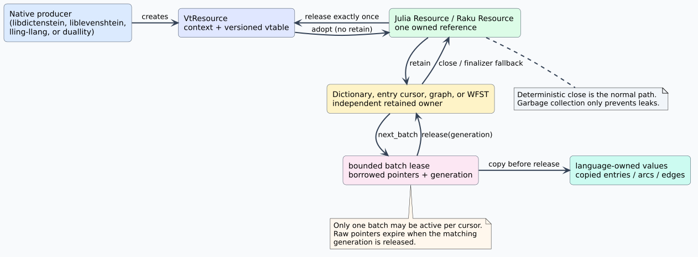

# Julia and Raku resource-ABI bindings

The Julia package `VinaryTreeInterop` and the Raku distribution
`Vinary-Tree-Interop` provide language-native access to the same stable,
versioned C resource application binary interface (ABI). An ABI is the binary
contract that fixes data layouts, calling conventions, ownership rules, and
result codes between independently compiled components.

These packages are the shared foundation for the Julia and Raku bindings of
`llattice`, `libdictenstein`, `liblevenshtein`, `lling-llang`, and `duallity`.
They do not duplicate automata algorithms. Native producers implement the
algorithms once in Rust and expose dictionaries or scalar weighted finite-state
transducers (WFSTs) as retained resources.



## Design and ownership

`VtResource` is a two-word owned handle: a context pointer and a pointer to a
versioned function table. The function table supports three operations:

1. `retain` creates another independent reference.
2. `release` destroys exactly one reference.
3. `query_interface` discovers a typed optional interface without changing the
   resource ABI.

The language wrappers preserve that algebra. If `r` is the current native
reference count, ownership transitions obey:

```math
r_{t+1} = r_t + N_{\mathrm{retain}} - N_{\mathrm{release}}
```

Every successful retain is paired with exactly one release. Julia's
`borrow_resource` and Raku's `borrow-resource` first retain provider-owned
borrowed words; their `adopt` counterparts transfer an already-owned reference.
Julia's `close` and Raku's `.close` are deterministic. Finalizers are fallback
leak protection, not a substitute for explicit ownership.

### Snapshot consistency

A dictionary or WFST snapshot owns a retained native resource. Node and state
identifiers are scoped to that snapshot. A later mutation of the producer
cannot change the captured traversal. A compact graph view borrows immutable
native slices and retains its snapshot for the entire view lifetime.

### Bounded streaming

Entry cursors expose finite lexicographic streams. Each call supplies hard
limits for entry descriptors, units, and values. The cursor returns a batch
lease identified by a generation. A second batch cannot be acquired until the
first generation is released.

The high-level iterators copy each bounded page into language-owned values
before release. Performance-sensitive callers can use `with_batch` and inspect
the active raw view inside the callback, but no pointer may escape that dynamic
scope.

The streaming algorithm is:

```text
open a cursor over an immutable snapshot
loop:
    request a page subject to explicit hard limits
    if the provider reports end, close the cursor and stop
    copy or reduce every entry while the generation is active
    release that exact generation on success or failure
```

This uses constant native lease memory with respect to dictionary cardinality.
If `B` is the maximum page footprint and `n` is the number of entries, native
lease space is `O(B)`, while total traversal work remains `O(n)` plus key data.

## Host-language idioms

Julia dictionaries implement `AbstractDict`; Unicode-scalar resources use
`String` keys, byte resources use `Vector{UInt8}`, and vocabulary resources use
`Vector{UInt64}`. `close`, `haskey`, indexing, `length`, iteration, `do` blocks,
and typed exception handling work as Julia users expect.

Raku dictionaries implement `Associative`, and entry cursors implement
`Iterable`. Missing optional unsigned values use the `UInt` type object, so
callers can distinguish presence with `:exists`. Batch and cursor objects have
deterministic `.release` and `.close` methods with garbage-collection fallback.

## Callback and concurrency safety

Reducers call back into Julia or Raku synchronously on the language-owned thread
that entered native code. Every language exception is contained inside the C
callback, translated to `VT_STATUS_PROVIDER_ERROR`, and re-thrown only after
native control returns. Exceptions never unwind through C or Rust frames.

Neither package advertises arbitrary native-thread language providers. A native
worker created outside Julia or Rakudo cannot safely enter those runtimes merely
because a function pointer exists. A future provider interface must carry an
explicit thread-affinity contract or marshal work onto a runtime-owned executor.
The current consumer and synchronous reducer interfaces are safe without that
unproven assumption.

## ABI verification

The test fixture is compiled from the authoritative C header. Julia checks
`sizeof` for every ABI type against C, while Raku checks `nativesizeof` against
the same fixture. Both suites execute calls through actual function pointers,
exercise retain/release accounting, page dictionary edges and WFST arcs, reduce
entry streams, contain hostile reducer exceptions, and prove collection idioms.

Raku fixed-size padding fields are represented as individual native scalars.
This is layout-equivalent to a C array and avoids assigning or garbage-collecting
a borrowed `CArray`. The native-size correspondence test guards every field
group against drift.

## Performance model

Calls through the resource ABI are designed around coarse operations:

- fused finality and edge inspection when the optional visit interface exists;
- bounded edge, arc, and entry pages to amortize foreign-call overhead;
- compact immutable graph slices for zero-copy traversal;
- provider-side reducers when per-entry callbacks would dominate runtime.

The wrappers do not add global locks. A resource advertises parallel reentrancy
only when the native provider guarantees it. Julia and Raku collections retain
specialized native traversal and copy only at explicit ownership boundaries.

## Security boundaries

All foreign pointers are treated as untrusted provider output. Wrappers reject
null required pointers, unsupported interface versions, over-capacity page
counts, stalled pagination, invalid entry value widths, use after close, and a
second active batch. Raw views are exposed only with a retained owner and an
explicit lease lifetime.

The packages never load a native library by an untrusted search result. A
library-specific binding resolves its signed/reproducible release artifact and
then transfers the resulting resource into this shared layer.

## References

- Julia, [Calling C and Fortran Code](https://docs.julialang.org/en/v1/manual/calling-c-and-fortran-code/).
- Raku, [Native calling interface](https://docs.raku.org/language/nativecall).
- Julia Pkg, [Artifacts](https://pkgdocs.julialang.org/v1/artifacts/).
- Raku, [Uploading distributions](https://docs.raku.org/language/distributions/uploading).
