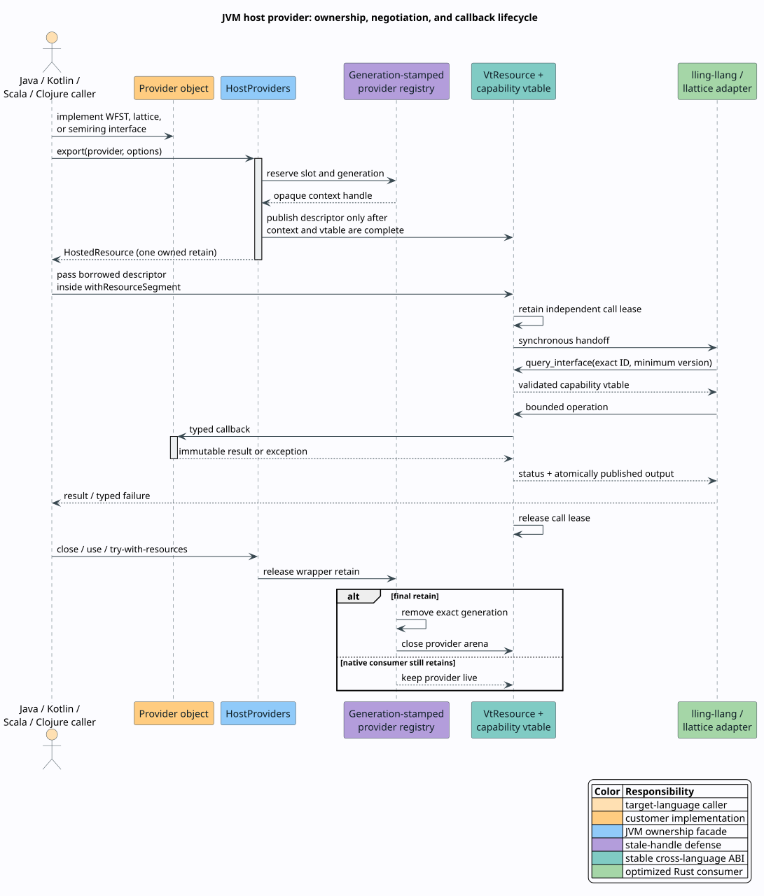

# JVM host providers

The JVM binding lets Java, Kotlin, Scala, and Clojure code supply live weighted
finite-state transducers (WFSTs), lattice values, and semirings to Vinary Tree
algorithms without reimplementing those algorithms on the JVM. The same
customer object can be handed to `lling-llang`, `llattice`, or another consumer
that negotiates the corresponding stable capability.

A **host provider** is a target-language object whose methods implement one
negotiated capability. A **resource** is the two-word `VtResource` descriptor
that carries an opaque context and a base virtual table. A **capability** is a
versioned operation table discovered by its exact 16-byte interface identity.
The provider remains a normal garbage-collected JVM object; the resource facade
roots it until the last native or managed retain is released.



## Choose the narrowest provider family

| Customer capability | JVM interface | ABI identity | Typical Rust consumer |
|---|---|---|---|
| Immutable scalar WFST | `ScalarWfstProvider` | `vt.scalar-wfst.1` | `lling-llang` composition, decoding, and traversal |
| Immutable lattice value | `LatticeProvider` | `vt.lattice.val.1` | dynamic `llattice` join/meet adapters |
| Canonically encodable lattice | `StableLatticeProvider` | lattice stable-byte operation | cross-provider decoding, hashing, and persistence |
| Semiring operation context | `SemiringProvider<T>` | `vt.semiring.val1` | dynamic `lling-llang` algebra and weighted algorithms |
| Quotient operations | `DivisibleSemiringProvider<T>` | `vt.semiring.div1` | divisible and weakly left-divisible algorithms |
| Kleene closure | `StarSemiringProvider<T>` | `vt.semiring.str1` | closure algorithms that admit partial divergence |
| Numeric projections | `NumericSemiringProvider<T>` | `vt.semiring.num1` | numerical weights, quantization, and stochastic sampling |
| Declared algebraic laws | `SemiringOptions` | `vt.semiring.prp1` | lawful specialization and validation |

Implement only optional capabilities that are mathematically valid for the
domain. For example, returning an arbitrary answer from `star` is worse than
omitting `StarSemiringProvider`: the optional interface is a semantic promise,
not a convenience method.

## Ownership: deterministic first, cleaner second

`HostedResource` and `UnicodeDictionaryResource` implement `AutoCloseable`.
Use Java try-with-resources, Kotlin `use`, Scala `Using.resource`, or Clojure
`with-open`. Their cleaners are leak-safety fallbacks, not the primary lifetime
mechanism.

The scoped `withResourceSegment` method acquires an independent retain before
exposing the descriptor. This matters when another thread may close the wrapper
while a synchronous native call is in progress:

```java
try (HostedResource resource = HostProviders.scalarWfst(provider)) {
    resource.withResourceSegment(segment -> {
        System.out.printf("resource descriptor at 0x%x%n", segment.address());
    });
}
```

The following ownership rules are invariant:

1. Construction publishes no handle until the context, callback tables, and
   resource descriptor are complete.
2. Each successful retain has exactly one release.
3. `close()` is idempotent and releases only the wrapper's retain.
4. A native consumer that retained the resource may outlive the wrapper.
5. A callback operand is borrowed only until that callback returns.
6. Stale and cross-provider tokens are rejected by provider-scoped generations
   and cookies.

The JVM implementation uses no process-wide provider lock. Steady-state handle
lookups are lock-free. A foreign lattice provider that does not advertise
parallel reentrancy receives an exact, lifecycle-bounded serial gate; unrelated
providers never collide. Providers that advertise `PARALLEL_REENTRANT` and
same-JVM fast paths do not take those gates.

## Java: supply an immutable WFST

A scalar WFST exposes stable provider-scoped state identifiers. Empty
`OptionalLong` labels denote epsilon; zero is an ordinary label and must never
be used as an epsilon sentinel.

```java
ScalarWfstProvider greeting = new ScalarWfstProvider() {
    @Override public long startState() {
        return 0;
    }

    @Override public OptionalLong stateCount() {
        return OptionalLong.of(2);
    }

    @Override public ScalarWfstStateInfo stateInfo(long state) {
        return switch ((int) state) {
            case 0 -> new ScalarWfstStateInfo(true, false, 0.0);
            case 1 -> new ScalarWfstStateInfo(true, true, 0.0);
            default -> new ScalarWfstStateInfo(false, false, 0.0);
        };
    }

    @Override public List<ScalarWfstArc> stateArcs(long state) {
        return state == 0
            ? List.of(new ScalarWfstArc(
                OptionalLong.of('h'), OptionalLong.of('h'), 1, 0.25))
            : List.of();
    }
};

var options = new ScalarWfstOptions(
    DictionaryUnitDomain.UNICODE_SCALAR,
    ScalarWeightDomain.TROPICAL_F64,
    ScalarWfstOptions.ACYCLIC | ScalarWfstOptions.PARALLEL_REENTRANT);

try (HostedResource resource = HostProviders.scalarWfst(greeting, options)) {
    resource.withResourceSegment(segment -> {
        System.out.printf("WFST descriptor at 0x%x%n", segment.address());
    });
}
```

`stateInfo` must return `valid=false` for an unknown identifier. `stateArcs`
must return an immutable traversal view for a valid state. The facade validates
every requested page before writing any arc, so an invalid label, weight, or
null arc cannot expose a partially initialized native buffer. It also adds the
`IMMUTABLE` capability because each exported WFST revision is immutable.

Compact and lazy providers should override `stateArcsPage`. The paged callback
receives the native start index and bounded capacity directly, reports the
complete outgoing count, and avoids both whole-list materialization and a
redundant `stateInfo` dispatch. The default derives a page from `stateArcs` for
small or already-materialized graphs.

Weight domains are validated at the boundary:

| Domain | Accepted Java values |
|---|---|
| `TROPICAL_F64`, `LOG_F64`, `SIGNED_TROPICAL_F64` | finite values and positive infinity |
| `ARCTIC_F64` | finite values and negative infinity |
| `PROBABILITY_F64` | finite, nonnegative values |
| `COUNT_F64` | exact nonnegative integers no greater than $`2^{53}`$ |
| `BOOLEAN_F64` | exactly zero or one |

## Java: supply a lattice value

A lattice has a partial order represented by join $`\sqcup`$ and meet
$`\sqcap`$. `DomainId` prevents unrelated implementations from being combined
merely because their wire layouts happen to match.

```java
record Maximum(int value) implements StableLatticeProvider {
    @Override public LatticeProvider join(LatticeOperand other) {
        return new Maximum(Math.max(value, decode(other)));
    }

    @Override public LatticeProvider meet(LatticeOperand other) {
        return new Maximum(Math.min(value, decode(other)));
    }

    @Override public boolean equalsValue(LatticeOperand other) {
        return value == decode(other);
    }

    @Override public byte[] stableBytes() {
        return ByteBuffer.allocate(4).putInt(value).array();
    }

    @Override public String diagnostic() {
        return Integer.toString(value);
    }

    private static int decode(LatticeOperand other) {
        return other.localProvider(Maximum.class)
            .map(Maximum::value)
            .orElseGet(() -> ByteBuffer.wrap(other.stableBytes()).getInt());
    }
}

var domain = DomainId.fromAscii("example.maximum1");
try (HostedResource value =
        HostProviders.lattice(new Maximum(7), new LatticeOptions(domain))) {
    value.withResourceSegment(segment -> {
        System.out.printf("lattice descriptor at 0x%x%n", segment.address());
    });
}
```

`localProvider` is the allocation-free same-JVM path. `stableBytes` is the
bounded cross-provider path and must be deterministic and canonical for the
domain. The facade defensively copies provider byte arrays. Every
`LatticeOperand` expires when `join`, `meet`, or `equalsValue` returns; retaining
one in a field and reading it later raises `IllegalStateException`.
Because the JVM API deliberately exposes no unsafe raw foreign handle, a
foreign operand must advertise stable bytes; otherwise the operation returns
`UNSUPPORTED`. Values returned by `join` and `meet` inherit the receiver's
`LatticeOptions`, so they must satisfy the same threading promise.

## Java: supply a semiring and refinements

A semiring defines addition $`\oplus`$, multiplication $`\otimes`$, additive
identity $`0_S`$, and multiplicative identity $`1_S`$. The provider must satisfy
associativity, both identities, and distributivity. Declare properties such as
idempotence or total order only when the domain satisfies their laws.

```java
final class Probability
        implements DivisibleSemiringProvider<Double>,
                   StarSemiringProvider<Double>,
                   NumericSemiringProvider<Double> {
    public Double zero() { return 0.0; }
    public Double one() { return 1.0; }
    public Double cloneValue(Double value) { return value; }
    public Double plus(Double left, Double right) { return left + right; }
    public Double times(Double left, Double right) { return left * right; }
    public boolean equalsValue(Double left, Double right) {
        return Double.doubleToRawLongBits(left)
            == Double.doubleToRawLongBits(right);
    }
    public boolean approximatelyEquals(
            Double left, Double right, double epsilon) {
        return Math.abs(left - right) <= epsilon;
    }
    public SemiringOrder compareNatural(Double left, Double right) {
        int order = Double.compare(left, right);
        return order < 0 ? SemiringOrder.BETTER
             : order > 0 ? SemiringOrder.WORSE
             : SemiringOrder.EQUAL;
    }
    public byte[] stableBytes(Double value) {
        return ByteBuffer.allocate(8)
            .putLong(Double.doubleToRawLongBits(value)).array();
    }
    public String diagnostic() { return "probability semiring"; }
    public String diagnostic(Double value) { return value.toString(); }
    public Optional<Double> divide(Double value, Double divisor) {
        return divisor == 0.0
            ? Optional.empty() : Optional.of(value / divisor);
    }
    public Optional<Double> leftDivide(Double value, Double divisor) {
        return divide(value, divisor);
    }
    public Optional<Double> star(Double value) {
        return Math.abs(value) < 1.0
            ? Optional.of(1.0 / (1.0 - value)) : Optional.empty();
    }
    public double numericalValue(Double value) { return value; }
    public long quantize(Double value, double epsilon) {
        return Math.round(value / epsilon);
    }
    public double toProbability(Double value) { return value; }
}

var options = new SemiringOptions(
    DomainId.fromAscii("example.probabi1"),
    SemiringOptions.PARALLEL_REENTRANT,
    SemiringOptions.COMMUTATIVE_TIMES
        | SemiringOptions.TOTALLY_ORDERED
        | SemiringOptions.NONNEGATIVE,
    OptionalLong.empty());

try (HostedResource semiring = HostProviders.semiring(
        new Probability(), options, SemiringValueCodec.doubles())) {
    semiring.withResourceSegment(segment -> {
        System.out.printf("semiring descriptor at 0x%x%n", segment.address());
    });
}
```

The codec form stores binary64 payloads in a primitive, generation-stamped
lease arena. It avoids per-token Java value objects while preserving the ABI's
linear ownership rules; it does not promise that Java generic dispatch itself
is allocation-free. Without a codec, the runtime uses a recyclable,
generation-stamped object arena for arbitrary immutable JVM values.
Batch release is transactional: a forged, duplicate, stale, or cross-context
token rejects the entire batch without releasing a prefix.

`Optional.empty()` from division or closure maps to the ABI's explicit `END`
status. It is not a zero value and does not publish an output token.

## Kotlin, Scala, and Clojure idioms

The public interfaces contain no Java-only abstract classes, reflection
requirements, or generated proxies. Each JVM language implements the same
typed interfaces directly.

Kotlin uses object expressions and `use`:

```kotlin
val weights = object : SemiringProvider<Long> {
    override fun zero() = 0L
    override fun one() = 1L
    override fun cloneValue(value: Long) = value
    override fun plus(left: Long, right: Long) = left + right
    override fun times(left: Long, right: Long) = left * right
    override fun equalsValue(left: Long, right: Long) = left == right
    override fun approximatelyEquals(left: Long, right: Long, epsilon: Double) =
        left == right
    override fun compareNatural(left: Long, right: Long) =
        left.compareTo(right).let {
            if (it < 0) SemiringOrder.BETTER
            else if (it > 0) SemiringOrder.WORSE
            else SemiringOrder.EQUAL
        }
    override fun stableBytes(value: Long) =
        ByteBuffer.allocate(8).putLong(value).array()
    override fun diagnostic() = "integer weights"
    override fun diagnostic(value: Long) = value.toString()
}

HostProviders.semiring(
    weights,
    SemiringOptions(DomainId.fromAscii("kotlin.weights.1"))
).use { resource ->
    resource.withResourceSegment(java.util.function.Consumer { segment ->
        check(segment.address() != 0L)
    })
}
```

Scala uses anonymous implementations or case classes and `Using.resource`.
Clojure uses `reify` or `deftype` and `with-open`. Executable, compiler-checked
examples for all three are maintained beside the Java ABI suite:

- [Kotlin provider fixture](../../bindings/jvm/src/test/kotlin/io/vinarytree/interop/KotlinProviderSmoke.kt)
- [Scala provider fixture](../../bindings/jvm/src/test/scala/io/vinarytree/interop/ScalaProviderSmoke.scala)
- [Clojure provider fixture](../../bindings/jvm/src/test/clojure/io/vinarytree/interop/provider_smoke.clj)

## Threading promises

Provider flags describe what the customer object can actually tolerate:

| Flag | Meaning |
|---|---|
| no threading flag | callbacks may be serialized by a consumer-side gate |
| `THREAD_BOUND` | a callback stays on the runtime-attached thread that entered the consumer call |
| `PARALLEL_REENTRANT` | callbacks may overlap and may reenter the provider |

`THREAD_BOUND` and `PARALLEL_REENTRANT` are mutually exclusive. Neither means
that callbacks run on the thread that originally constructed the provider.
Do not advertise parallel reentrancy for a mutable provider unless its own
synchronization and callback graph support overlapping calls.

No foreign callback is made while an internal Vinary Tree lock is held. Batch
callbacks are bounded to 256 operands so providers can amortize the language
boundary without granting unbounded allocation authority.

## Failure containment and diagnostics

Every upcall trampoline catches every Java `Throwable`. `OutOfMemoryError` maps
to `LIMIT_EXCEEDED`; an intentional `ProviderException` maps only its validated
portable status; all other failures map to `PROVIDER_ERROR`. Use
`ProviderException.Status.INVALID_ARGUMENT` for an unknown provider-scoped node
or state and `IO_ERROR` for a backing-store failure. The facade records the
original throwable, available from `HostedResource.lastCallbackError()` or
`UnicodeDictionaryResource.lastCallbackError()`.

Output publication is transactional. The runtime validates inputs and provider
results before writing caller-owned memory. A failed operation therefore leaves
its output unchanged, except that a successful release intentionally zeros the
released token storage.

Callers should branch on typed status or `DictionaryInteropException.status()`,
then attach diagnostics for humans. Diagnostic strings are not stable machine
protocols.

## Validation and release gate

Run the complete JVM contract from the repository root:

```sh
JAVA_TOOL_OPTIONS="-Djava.io.tmpdir=$PWD/target/tmp" \
  bindings/jvm/gradlew --no-daemon -p bindings/jvm check javadoc
```

`check` performs all of the following:

1. compiles the public artifact for Java 22;
2. executes native downcall-to-upcall ABI tests under JUnit;
3. executes the standalone lifecycle, hostile-input, paging, algebra, and
   concurrency suite;
4. compiles and runs Java, Kotlin, Scala, and Clojure provider implementations.

Release CI repeats the gate on the Java 22 minimum and Java 25. The Maven
artifact is staged only after both pass.

The JAR's automatic module name is `io.vinarytree.interop`. On the classpath,
grant FFM access with `--enable-native-access=ALL-UNNAMED`. On the module path,
grant only this binding with `--enable-native-access=io.vinarytree.interop`.

The JVM facade uses the stable Foreign Function and Memory API standardized by
[JEP 454](https://openjdk.org/jeps/454). The checked-in Gradle wrapper pins a
toolchain combination supported by the
[Kotlin Gradle compatibility table](https://kotlinlang.org/docs/gradle-configure-project.html)
and the [Gradle Scala plugin](https://docs.gradle.org/current/userguide/scala_plugin.html).
The Clojure fixture pins the current stable release listed on the
[official downloads page](https://clojure.org/releases/downloads).
