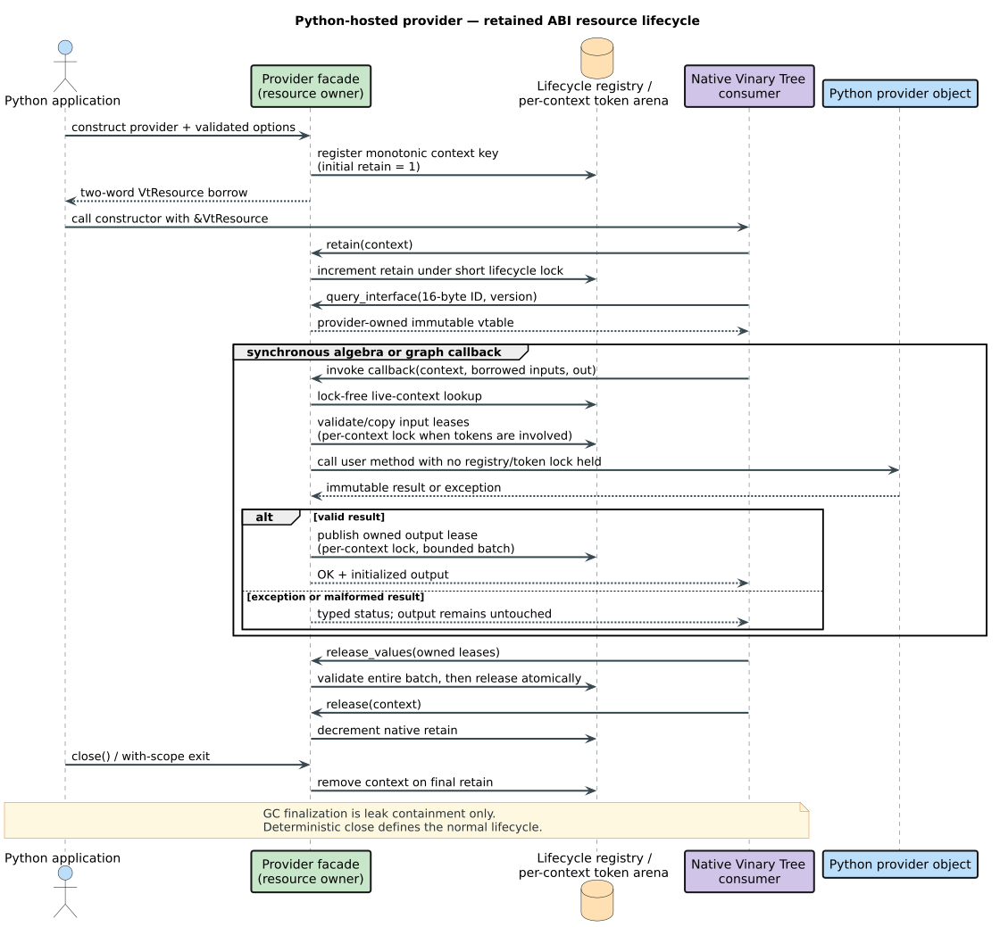
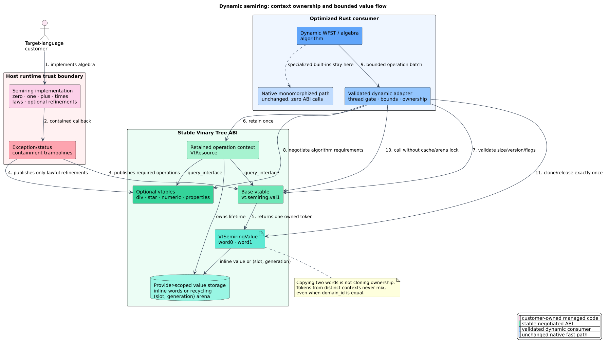

# Python resource providers and consumers

The `vinary-tree-interop` Python package turns ordinary Python objects into
versioned resources that native Vinary Tree libraries can retain and consume.
It covers immutable Unicode dictionaries, scalar weighted finite-state
transducers (WFSTs), lattice values, and semiring operation contexts. The
facade contains the Python callbacks and ownership machinery; algorithms stay
in their owning libraries such as `libdictenstein`, `liblevenshtein`, and
`lling-llang`.

The same package also provides `ScalarWfst`, an ownership-safe consuming view
for inspecting a compatible scalar WFST produced by Python, Rust, or another
language binding. It centralizes interface negotiation, bounded paging, and
snapshot lifetime so project packages do not duplicate that logic.

This guide is for application and binding authors who need native algorithms
to call a custom Python data source or algebra. For the byte-for-byte wire
contract, use the [ABI reference](../abi-reference.md).

## Concepts

A **resource** is the two-word `VtResource` pair: an opaque context pointer and
a pointer to an immutable base virtual-function table (vtable). A resource is
borrowed until a consumer calls `retain`; each successful retain must be paired
with exactly one `release`.

A **provider** is a Python object whose methods supply graph or algebra
operations. A **snapshot** is an immutable revision captured from a mutable
source. A **capability** is an independently negotiated interface identified
by an exact 16-byte ID and a minimum version. A **lease** is an owned semiring
value token that is meaningful only to the operation context that issued it.



The shared resource model avoids exposing Python object layout, Rust layout,
or garbage-collector internals across the boundary. Interface negotiation also
lets old and new packages coexist: a consumer requests only the capability and
version it understands.

## Install and run the maintained example

Python 3.10 and newer are supported.

```sh
python -m pip install vinary-tree-interop
python bindings/python/examples/host_providers.py
```

The repository example constructs all four provider families using public
APIs. CI executes it on the oldest supported Python, the current release, and
the current free-threaded CPython build.

## Dictionary snapshots

`UnicodeDictionaryResource(capture, parallel_reentrant=False)` adapts a
callable that returns an immutable `UnicodeDictionarySnapshot`. The snapshot
methods are:

| Method | Contract |
|---|---|
| `root()` | Return a node ID in the unsigned 64-bit range. |
| `__len__()` | Return the exact number of accepted terms. |
| `is_final(node)` | Return `bool`, indicating whether the node accepts a term. |
| `value(node)` | Return an optional unsigned 64-bit value. |
| `edges(node)` | Return ordered `(Unicode scalar, child node)` pairs. |

Capture must be an inexpensive linearization point. It should return a stable
revision rather than copying an entire trie while a native search is waiting.
The captured object is retained independently, so a search may outlive the
mutable source that produced it.

```python
from vinary_tree_interop import UnicodeDictionaryResource


class Snapshot:
    def root(self) -> int:
        return 0

    def __len__(self) -> int:
        return 1

    def is_final(self, node: int) -> bool:
        return node == 1

    def value(self, node: int) -> int | None:
        return 42 if node == 1 else None

    def edges(self, node: int):
        return (("x", 1),) if node == 0 else ()


with UnicodeDictionaryResource(lambda: Snapshot()) as dictionary:
    native_resource = dictionary.native_resource
    assert native_resource.context
```

Pass `native_resource` by pointer to the project-specific native constructor.
The consumer must retain the resource when its result outlives that
synchronous call.

## Scalar WFST snapshots

`ScalarWfstResource` adapts an immutable `ScalarWfstSnapshot` with `start()`,
`num_states()`, and `state(id)` methods. A state is represented by
`ScalarWfstState(final_weight, arcs)`; each `ScalarWfstArc` carries optional
input/output labels, a target state, and a scalar weight.

Choose the declared domains explicitly:

- `UnitDomain.BYTE`, `UNICODE_SCALAR`, or `U64` controls label validation.
- `WeightDomain` identifies tropical, log, probability, arctic,
  signed-tropical, count, or Boolean scalar semantics.
- `lazy=True` says the graph may discover states on demand.
- `acyclic=True` is a semantic promise used by eligible algorithms.

The facade caches each immutable state after its first request. A parallel
provider may calculate the same state twice during a race, but publication is
atomic and no process-wide callback lock serializes independent expansions.
State providers must therefore be deterministic for a captured revision.

### Consume any scalar WFST

`ScalarWfst(resource)` borrows a live resource only during construction and
obtains its own retain. The producer may close immediately afterward. Calling
`snapshot()` captures another independently owned immutable revision.

```python
from vinary_tree_interop import (
    ScalarWfst,
    ScalarWfstArc,
    ScalarWfstResource,
    ScalarWfstState,
)


class TinyWfst:
    def start(self) -> int:
        return 0

    def num_states(self) -> int:
        return 2

    def state(self, state: int) -> ScalarWfstState | None:
        if state == 0:
            return ScalarWfstState(
                None, (ScalarWfstArc("a", "b", 1, 0.25),)
            )
        if state == 1:
            return ScalarWfstState(0.0, ())
        return None


provider = ScalarWfstResource(lambda: TinyWfst(), acyclic=True)
with ScalarWfst(provider) as graph:
    provider.close()
    assert graph.start == 0
    assert graph.state_count == 2
    with graph.snapshot() as frozen:
        state = frozen.state(frozen.start, batch_size=64)
        assert state is not None
```

The view exposes validated `unit_domain`, `weight_domain`, and `flags`
properties. `state_info(id)` reads finality without copying arcs. `arcs(id,
batch_size=...)` drains bounded pages and rejects count changes or a page that
makes no progress. `state(id, batch_size=...)` combines both operations.
`state_count` is `None` for a genuinely lazy unknown-size graph; `len(graph)`
therefore raises `TypeError` rather than reporting an incomplete frontier.

Application code normally uses the retaining constructor above. A native
project facade may instead use `ScalarWfst.adopt(raw_resource)` when a C call
returns a `VtResource` that already transfers exactly one retain. Adoption is
the zero-copy ownership handoff: it must not be used for an ordinary borrowed
resource.

## Lattice values

A lattice is a partially ordered domain with binary **join** and **meet**.
For values $`a`$ and $`b`$, join $`a \mathbin{\vee} b`$ is their least upper
bound and meet $`a \mathbin{\wedge} b`$ is their greatest lower bound.

`LatticeResource(provider, options)` exports one immutable Python value. The
provider implements:

| Method | Meaning |
|---|---|
| `join(other)` | Return a new value containing the least upper bound. |
| `meet(other)` | Return a new value containing the greatest lower bound. |
| `equal(other)` | Return exact semantic equality as `bool`. |
| `diagnostic()` | Return a human-readable `str`. |
| `stable_bytes()` | Optional canonical bytes for foreign implementations. |
| `join_many(others)` / `meet_many(others)` | Optional bounded bulk fast paths. |

`other` is a borrowed `LatticeOperand`. Its `python_value()` method returns the
original object when both values belong to this Python runtime. Otherwise,
`stable_bytes()` copies the foreign provider's canonical encoding. The operand
is invalid immediately after the callback returns and must never be retained.

`LatticeOptions` supplies an exact 16-byte `DomainId`. Two implementations may
interoperate only when that ID denotes the same value semantics and canonical
encoding. A matching byte string is a contract, not merely a type label.

## Semiring operation contexts

A semiring is a tuple $`(S, \oplus, \otimes, 0, 1)`$ in which
$`(S, \oplus, 0)`$ is a commutative monoid, $`(S, \otimes, 1)`$ is a monoid,
multiplication distributes over addition, and zero annihilates multiplication.
Weighted-automata algorithms use $`\oplus`$ to combine alternative paths and
$`\otimes`$ to extend a path. This abstraction and its algorithmic role are
described by Mohri's
[weighted-automata tutorial](https://research.google/pubs/weighted-automata-algorithms-tutorial/).

`SemiringResource(provider, options)` exports a base operation context. The
provider must implement identities, `plus`, `times`, exact and approximate
equality, natural order, canonical bytes, and diagnostics. It may also
implement these complete optional method groups:

| Capability | Python methods |
|---|---|
| Division | `divide` and `left_divide` |
| Kleene closure | `star` |
| Numeric projection | `numerical_value`, `quantize`, and `to_probability` |
| Batch fast path | `plus_many` and/or `times_many` |

An incomplete division or numeric group is rejected during construction;
silently advertising a partial algebra would make capability discovery
ambiguous. `None` from division or star means the mathematical result is
undefined and maps to `Status.END` without touching the output token.

### Declared laws

`SemiringProperty` communicates refinements that permit specialized native
algorithms: hash/equality coherence, additive idempotence, bounded closure,
zero-sum freedom, commutative multiplication, total order, and nonnegativity.
Set a bit only when the law holds for every value in the declared domain.
`closure_bound` is legal only with `K_CLOSED`.

The `lling-llang` dynamic adapter offers bounded representative law validation
before a customer provider selects a law-dependent algorithm. Finite samples
cannot prove a universal law, but they detect false declarations and turn them
into diagnostic provider failures rather than memory unsafety or silently
incorrect specialization.

### Value leases

Python values never cross the ABI directly. The facade stores them in a
per-context arena and returns a two-word `VtSemiringValue` lease. The first word
is a monotonic token and the second identifies the issuing context. This makes
stale and cross-context values detectable. `clone_value` creates independent
ownership; `release_values` validates the entire bounded batch before deleting
anything, so a duplicate or forged token cannot cause a partial release.



## Ownership and Python lifecycle

Use every resource as a context manager:

```python
with SemiringResource(provider, options) as semiring:
    native_resource = semiring.native_resource
    consume_synchronously(native_resource)
```

`close()` is idempotent and releases the facade's retain. A native object that
keeps the provider alive owns a separate retain. Accessing `native_resource`
after close raises `RuntimeError`. Garbage collection invokes a non-throwing
fallback so an accidentally abandoned facade does not remain registered, but
finalization timing is deliberately not part of the API contract.

## Concurrency and locking

Provider options distinguish three behaviors:

- The default permits callbacks only under consumer serialization.
- `thread_bound=True` requires callbacks to remain on the runtime-attached
  thread that entered the consumer call.
- `parallel_reentrant=True` promises that the Python provider tolerates
  overlapping calls and reentrancy.

The last two flags are mutually exclusive. Ordinary callbacks perform a
lock-free live-context lookup. A short process-wide lock protects only
register, retain, and release transitions; no customer callback executes while
it is held. Semiring leases use a per-context lock only to resolve or publish
tokens, and provider algebra executes after that lock is released. Batches are
capped at `RECOMMENDED_SEMIRING_BATCH` or `RECOMMENDED_LATTICE_BATCH` so hostile
inputs cannot force unbounded validation under a synchronization point.

Python's global interpreter lock does not replace these ownership rules.
The same conformance suite runs under free-threaded CPython, where the
interpreter's internal container synchronization replaces assumptions that
would otherwise be hidden by the global lock.

## Errors and hostile-provider containment

No Python exception may unwind through a C callback. The facade catches every
`BaseException`, records it in `last_callback_error`, and returns a typed
status. Raise `ProviderStatusError` to request one of the intentional portable
failure categories; unexpected exceptions become `Status.PROVIDER_ERROR`.

The boundary rejects null pointers, stale or foreign leases, invalid Unicode
scalars, out-of-range state IDs and quantization buckets, NaN weights,
malformed Boolean/order outputs, invalid optional-interface groups, oversized
batches, and oversized diagnostics or canonical encodings. A failed operation
leaves caller-owned output storage untouched.

Diagnostics are advisory text. Branch on `Status`, never by parsing a message.

## Performance model

The native monomorphized path remains the fastest path for built-in Rust
semirings and graph types. Python providers are intended for custom integration
where crossing the runtime boundary is necessary. Keep that cost bounded:

1. Capture immutable revisions once rather than rebuilding per callback.
2. Advertise parallel reentrancy only when it is actually safe.
3. Supply `plus_many`, `times_many`, `join_many`, and `meet_many` for hot bulk
   operations.
4. Use compact canonical encodings and local-object recovery for lattice
   operands.
5. Keep provider methods synchronous and avoid calling back into a resource
   whose consumer has not declared reentrancy support.

In literate pseudocode, a safe batch fold is:

```text
Given: a borrowed array of at most B provider-scoped leases
Validate every lease without changing ownership.
Copy references to the corresponding immutable Python values.
Release the per-context token lock.
Call the provider's bulk method, or fold from the correct identity.
Publish exactly one new owned lease for the result.
Return OK without retaining the caller's array.
```

Here $`B`$ is the published recommended batch bound. Validation is
transactional: if any lease is malformed, no input is released and no output
is published.

## Verification and maintenance

The executable conformance suite is
[`bindings/python/tests/test_providers.py`](../../bindings/python/tests/test_providers.py).
It pins LP64 layouts, every semiring capability table, snapshot behavior,
paging, retained consumer views, independent WFST snapshots, cross-context
rejection, transactional release, optional absence,
exception translation, malformed results, concurrency, and garbage-collection
fallback. The maintained public example is
[`bindings/python/examples/host_providers.py`](../../bindings/python/examples/host_providers.py).

Run both supported-version checks before changing the facade:

```sh
PYTHONPATH=bindings/python/src python3.10 -m unittest discover -s bindings/python/tests -v
PYTHONPATH=bindings/python/src python3.14 -m unittest discover -s bindings/python/tests -v
PYTHONPATH=bindings/python/src python3.14 bindings/python/examples/host_providers.py
```

CI additionally runs the same tests and example with the official `3.14t`
free-threaded build. The repository package gate verifies both the wheel and
the source archive, including a source-archive-to-wheel round trip:

```sh
./scripts/verify-python-package.sh python3.14 target/python-dist
```

Any wire-layout change starts in the canonical Rust/C ABI and requires a new
versioned capability or an additive size-gated extension. Do not edit Python
offsets independently.
